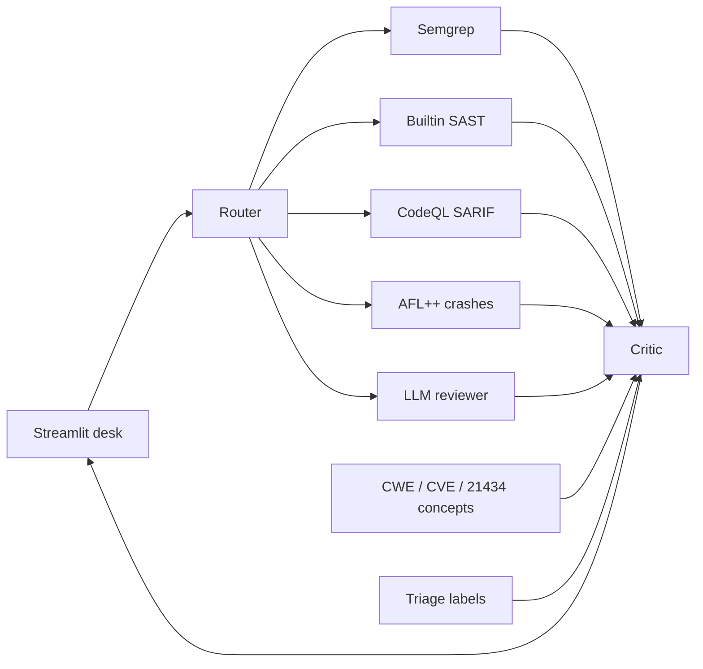

# Agentic AI security toolchain — SAE J1939

Portfolio project for **automotive AI security**. An agentic desk finds weaknesses in a small open-source **embedded C** CAN stack, maps each finding to a **CWE**, and lets you triage true/false positives.

This is **research / portfolio**. It analyzes public MIT-licensed code. It is not a complete ISO/SAE 21434 CSMS, TARA, or a substitute for Vector/CodeQL enterprise.

**Target:** [Open-SAE-J1939](https://github.com/DanielMartensson/Open-SAE-J1939) (MIT, ANSI C, ~33 `.c` files). Vendored under `vendor/Open-SAE-J1939` with license retained.

## What it demonstrates

| Side | What you see |
|---|---|
| **AI for security** (main) | Router + SAST (Semgrep + builtin C checkers + optional CodeQL SARIF) + AFL++ harness + LLM reviewer + critic + CWE RAG |
| **Security of AI** (supporting) | Prompt-injection document in the RAG folder is blocked by an allow-list + pattern filter. Bandit / Semgrep / Trivy run on *this* repo in CI. Secrets only via `.env` |

## Architecture



Same shape as the materials case desk: **router chooses specialists, tools return facts, critic last**.

## Demo finding (real code)

`SAE_J1939_Read_Transport_Protocol_Data_Transfer` does:

```c
uint8_t index = data[0] - 1;
j1939->from_other_ecu_tp_dt.data[index*7 + i-1] = data[i];
```

If the CAN frame sets `data[0] == 0`, `index` wraps to 255 (`CWE-190`) and the write is past `MAX_TP_DT` (`CWE-787`). The critic keeps this, cites [CWE-787](https://cwe.mitre.org/data/definitions/787.html), and suggests bounding the sequence number before the write.

TP.CM also copies `data[3]` as package count with no 2..224 check (`CWE-20`).

## Setup

```bash
python3 -m venv .venv
source .venv/bin/activate
pip install -r requirements.txt
cp .env.example .env   # optional GROQ_API_KEY for the LLM reviewer
python scripts/run_scan.py --query full
streamlit run apps/dashboard.py
```

Docker:

```bash
docker compose up --build
```

Open http://localhost:8501

AFL++ (optional, slower):

```bash
docker build -f fuzz/Dockerfile -t j1939-afl .
docker run --rm -v "$PWD/fuzz/out:/work/out" j1939-afl
```

Then run a scan; the AFL agent reads `fuzz/out/**/crashes`.

CodeQL: GitHub Actions workflow `codeql.yml` (manual/weekly). Point `CODEQL_SARIF` at a downloaded SARIF to fold it into the desk.

## Results (local builtin SAST + critic)

Run `python scripts/run_scan.py` after clone. Typical first run on this vendored tree:

| | Count |
|---|---|
| Raw tool hits (builtin SAST, no Semgrep required) | 4 (TP.DT index + write, two TP.CM package-count sites) |
| After critic (noise dropped) | 4 kept on the first SAST-only run (0 comment-noise to drop) |
| False-positive rate | 0 labelled until you triage; labels in `data/labels.json` change ranking on the next run |

Semgrep with `rules/embedded-c.yml` duplicates the same sites when `semgrep` is installed. LLM findings appear only with `GROQ_API_KEY`.

## Prompt injection (Part A)

`rag/knowledge/poison.md` tells the model to ignore instructions.  
`python -c "from secagent.injection_demo import run_demo; print(run_demo())"`  
shows the poison **loads** with `allow_untrusted=True` and **does not load** with the default allow-list.

## Scope (honest)

- Analyzes Open-SAE-J1939 only, not OEM IP.
- 21434 notes are **original concept summaries**, not the paid standard.
- AFL++ is one harness, not a long campaign.
- CodeQL is CI/SARIF ingest, not a full database on your laptop.
- No hardcoded secrets. Groq key from the environment only.
